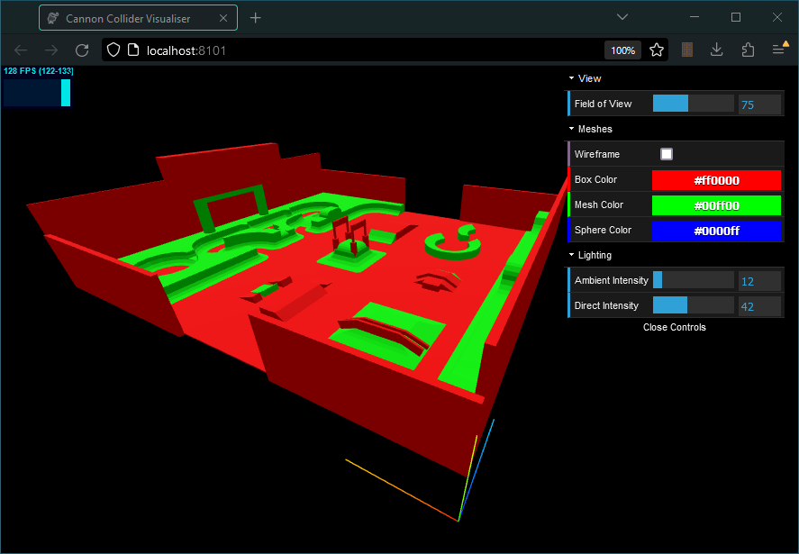

# Cannon Collider Visualiser

This repo uses ThreeJS to visualise the colliders in a JSON file exported by the Blender plugin: [Decentraland Toolkit: Cannon Colliders](https://github.com/stom66/blender-dcltk-cannon-colliders/).



## Getting Started

1. Clone this repository to your local machine:

    ```bash
    git clone https://github.com/stom66/cannon-collider-visualiser.git
    ```

2. Navigate to the project directory and run:

    ```bash
    npm install
    ```

3. Start the development server:

    ```bash
    npx vite
    ```

This will start a development server using Vite, and you should see the demo running in your browser at `http://localhost:8101`.

Use your mouse to navigate the viewport:
	
* Left-click to **rotate**
* Right-click to **move**
* Scroll to **zoom**

## Switching colliders

by default the file `src/colliders.json` is loaded. To use your own colliders either overwrite this file with your own or update the import statement in `_main.ts` at line #69.


### Sources

Some code in this repository comes from: https://sbcode.net/threejs/physics-cannonDebugrenderer/
